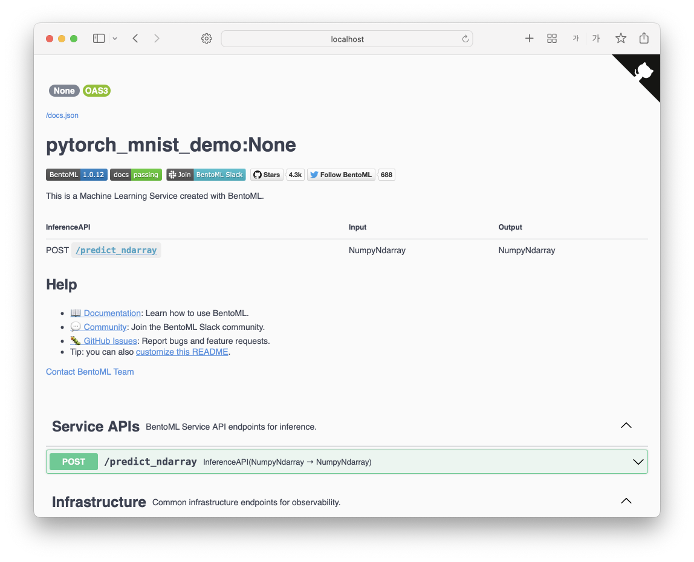

## BentoML PyTorch MNIST Tutorial
Here is a tutorial on how to use BentoML to package a PyTorch model trained on the MNIST dataset, using the example code provided at the [bentoml repo](https://github.com/bentoml/BentoML/tree/main/examples/pytorch_mnist)

<br>

For detailed explanations of the code, please click the following link.

[https://pebpung.github.io/engineering/2022/12/24/BentoML.html](https://pebpung.github.io/engineering/2022/12/24/BentoML.html)

## Prerequisites

- Install the required dependencies by running the following command:

```bash
pip install -r requirements.txt
```

## Training the model

1. Clone the repository and navigate to the root directory:

```bash
git clone https://github.com/PEBpung/MLOps-Tutorial
cd MLOps-Tutorial/4.bentoml
```

1. Take a look at the **`train.py`** file. This file contains code for training a PyTorch machine learning model using the **`model.py`** file, as well as code for packaging the model with BentoML.
2. Run the following command to train and package the model:

```bash
python train.py
```

<details>
<summary>📌 View Train Result</summary>

```bash
Training using cpu.
Train Epoch: 0  Loss: 0.505
Train Epoch: 1  Loss: 0.225
Train Epoch: 2  Loss: 0.169
Test Result ACC: 0.956
Saved model: Model(tag="pytorch_mnist:gmkted4dgkuoyycf")
```
</details>

This will create a BentoML package containing the trained model and the necessary functions for serving it.

## Serving the trained model
Take a look at the service.py file. This file contains code for serving the BentoML package as a REST API using FastAPI.

Run the following command to start the model server:

```bash
bentoml serve service:svc
```

This will start the model server and listen for HTTP POST requests at the /predict endpoint. The input data should be provided in the request body, and the expected output format should be specified in the Content-Type header.

<center></center>

## Build Bentos
To build a bento, first create a bentomlfile.yaml file, and then call build method to persist the bento to the bento store:

```bash
bentoml build
```
<details>
<summary>📌 View build Result</summary>

```bash
Building BentoML service "pytorch_mnist_demo:46blisedkgqesycf" from build context "/home/tesser/kimin/WandB-Tutorial/4.bentoml".
Packing model "pytorch_mnist:gmkted4dgkuoyycf"
Locking PyPI package versions.

██████╗░███████╗███╗░░██╗████████╗░█████╗░███╗░░░███╗██╗░░░░░
██╔══██╗██╔════╝████╗░██║╚══██╔══╝██╔══██╗████╗░████║██║░░░░░
██████╦╝█████╗░░██╔██╗██║░░░██║░░░██║░░██║██╔████╔██║██║░░░░░
██╔══██╗██╔══╝░░██║╚████║░░░██║░░░██║░░██║██║╚██╔╝██║██║░░░░░
██████╦╝███████╗██║░╚███║░░░██║░░░╚█████╔╝██║░╚═╝░██║███████╗
╚═════╝░╚══════╝╚═╝░░╚══╝░░░╚═╝░░░░╚════╝░╚═╝░░░░░╚═╝╚══════╝

Successfully built Bento(tag="pytorch_mnist_demo:46blisedkgqesycf").
```
</details>

## Containerize Bentos

```bash
bentoml containerize pytorch_mnist_demo:latest -t latest
```

This will create a Docker image named bentoml/pytorch_mnist_demo:latest, with all the required source code, models, and dependency packages bundled in the image.

The containerized bento can then be easily distributed and deployed to any environment.

```bash
# Run the containerized service
docker run -p 3000:3000 pytorch_mnist_demo:latest
```
